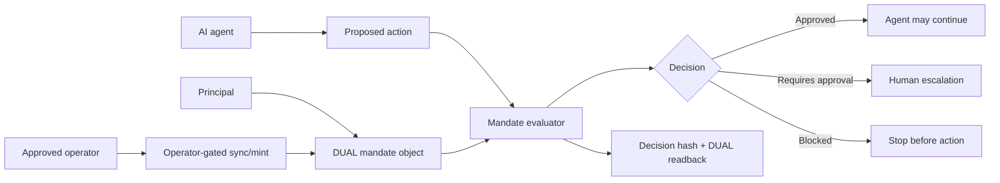
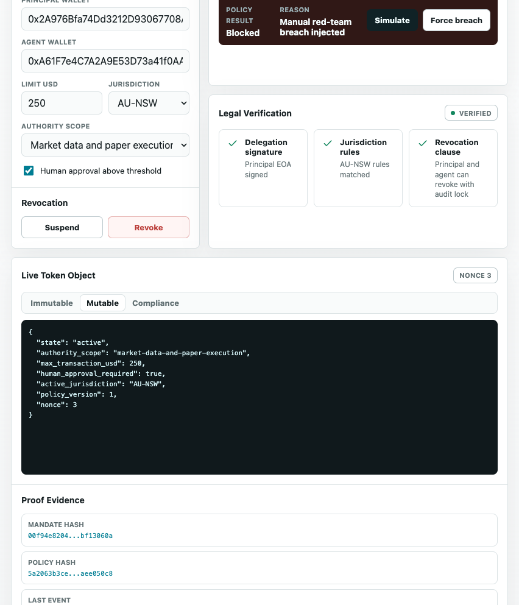

# Agent Mandates Demo Playbook

Live app: <https://agent-mandates-dual-demo.vercel.app/>

This playbook explains the demo as a presenter would run it: what to click, what the audience should notice, and what DUAL is proving at each point. It supports a 5-8 minute walkthrough, a 2-minute compressed pitch, and a handout for technical reviewers.

## Executive Summary

The Agent Mandates demo shows an AI agent acting under a DUAL-backed authority object. The agent can request a purchase, quote, paper trade, or other bounded action, but every request is evaluated against status, scope, jurisdiction, wallet, legal verification, spend limit, and human-approval rules before the user should let the agent continue.

The key message:

> DUAL turns delegated agent authority from a prompt into an inspectable mandate with hashes, readback, and a decision trail.

The demo is not a legal product. It is a proof surface for agent authority, readback, and public-safe verification.

## Demo Assets

| Asset | Path |
| --- | --- |
| Live app | <https://agent-mandates-dual-demo.vercel.app/> |
| Playbook | `docs/agent-mandates-demo-playbook.md` |
| Proof run sheet | `docs/agent-mandates-proof-run-sheet.md` |
| Agent usage guide | `docs/agent-usage.md` |
| Deployment notes | `DEPLOYMENT.md` |
| Desktop screenshot | `assets/agent-mandates-browser-full.png` |
| Mobile screenshot | `assets/agent-mandates-browser-mobile.png` |

## Demo Thesis

The app shows a principal giving an AI agent bounded authority. The mandate says who the agent is, what it can do, where it applies, how much it can spend, whether legal verification is active, and when human approval is needed.

DUAL supplies the control and evidence layer:

- a canonical mandate object;
- a reusable mandate template;
- readback and readiness signals;
- proof hashes for policy, mandate, state, integrity, events, and decisions;
- an MCP facade agents can call before consequential action;
- an operator-gated sync path for approved live DUAL updates.

Public users can inspect and simulate. They cannot write.

## Who This Demo Is For

| Audience | What they should take away |
| --- | --- |
| DUAL product team | Agent Mandates are a reusable proof/control primitive for AI action. |
| Developers | DUAL can sit between an agent and an external tool as a read-only authority checkpoint. |
| Enterprise / government buyers | Delegated agent authority can be scoped, explained, verified, and revoked. |
| AI-agent builders | Agents can call MCP before action and route decisions as continue, stop, or escalate. |
| Legal/compliance reviewers | The demo separates proof of authority from any claim of enforceable legal status. |

## Current State To Say Up Front

The production demo is DUAL-backed for readback and operator-gated for writes. The public surface is safe:

- no public DUAL writes;
- no write-capable MCP tools;
- no DUAL API key in the browser;
- no live sync on page load;
- wrong operator token returns `403`;
- evaluation returns decision hashes and readback identifiers.

Presenter line:

> "This is a public authority-check demo. Public users can read, evaluate, and verify. Only an approved operator can sync the canonical DUAL object."

## System Map



What this means:

- The agent does not decide its own authority.
- The mandate object defines the authority boundary.
- The evaluator produces an auditable decision.
- Agents and humans can both inspect the same proof surface.
- Live DUAL mutation is separate from public evaluation.

## Recommended Timing

| Segment | Time | Purpose |
| --- | ---: | --- |
| Open and frame | 45 sec | Establish read/evaluate/write boundaries. |
| Mandate state | 60 sec | Show principal, agent, scope, jurisdiction, and spend limit. |
| Safe action | 90 sec | Verify an in-scope action. |
| Proof | 90 sec | Show hashes, DUAL readback, object/template ids, and proof links. |
| Agent/MCP | 60 sec | Show the same decision path for agents. |
| Blocked action | 90 sec | Show enforcement on an oversized request. |
| Close | 30 sec | Tie back to verifiable delegated authority. |

Total: roughly 6-7 minutes.

## Two-Minute Version

Use this if the audience already understands DUAL.

1. Open the app and point to `Operator gated`, `DUAL readback`, and `publicWrites=false`.
2. Point to the authority corridor: principal, agent, scope, status, and limit.
3. Click `Verify agent action` on the default buyer-agent request.
4. Point to the decision, decision hash, object id, policy hash, and proof rail.
5. Click `Generate proof bundle`.
6. Switch to an oversized action and show the blocked result.
7. Close with: "The useful part is not that the agent can act. It is that the agent can be stopped before action when the mandate says no."

## 1. Open The App

Start at the live app. Point out the first-viewport signals:

- DUAL logo and Agent Mandates title.
- `Operator gated` write posture.
- Public simulation/readback disclosure.
- 60-90 second reviewer walkthrough.
- Left authority corridor, central mandate state, and right DUAL proof rail.


Presenter line:

> "This is an authority cockpit. The agent can request action, but the mandate controls whether it should proceed."

## 2. Explain The Mandate

The mandate is the agent's operating boundary.

In this demo it includes:

- Principal wallet.
- Agent wallet.
- Authority scope.
- Jurisdiction.
- Active/suspended/revoked status.
- Spend limit.
- Human approval requirement.
- Legal verification flag.
- Policy version/hash.
- Mandate hash.
- Last event hash.

Technical interpretation:

| Mandate field | Demo meaning |
| --- | --- |
| `principal_wallet` | Who delegated the authority. |
| `agent_wallet` | Which agent identity can use it. |
| `authority_scope` | What kind of action is allowed. |
| `jurisdiction` | Where the mandate applies. |
| `status` | Whether the mandate is active, suspended, or revoked. |
| `spend_limit_usd` | Per-action cap. |
| `human_approval_required` | Whether near-threshold actions must escalate. |
| `policy_hash` | Fingerprint of the active policy. |
| `mandate_hash` | Fingerprint of the mandate state. |

Buyer interpretation:

> "This is where an organization expresses what an agent is allowed to do before it touches a payment rail, marketplace, exchange, API, or workflow."

## 3. Verify A Safe Action

Use the default buyer-agent request:

- Action: `purchase`
- Label: `Buy verified inventory token`
- Amount: `$175`
- Counterparty: `verified-seller.dual`
- Agent: `agent-mandates-demo-agent-wallet-001`
- Jurisdiction: `AU-NSW`

Click `Verify agent action`.

What should happen:

- The evaluator returns a decision.
- The decision includes a reason.
- The proof block includes a decision hash.
- When production readback is configured, the proof includes the DUAL object id and template id.

Presenter line:

> "This is the authority check. The agent has not acted yet. We are proving whether it is allowed to act."

## 4. Show The Proof Path

Use the proof rail and proof path controls.


Call out these surfaces:

- DUAL object id.
- Template id.
- Policy hash.
- Mandate hash.
- State hash.
- Integrity hash.
- Decision hash.
- Local proof bundle hash.
- Console and explorer/search links.

Presenter line:

> "This is the trust receipt for authority. It ties the visible decision back to DUAL readback and stable hashes."

Proof interpretation:

| Proof row | Why it matters |
| --- | --- |
| Object id | Binds the UI to a canonical DUAL mandate object. |
| Template id | Shows the mandate follows a reusable schema. |
| Policy hash | Fingerprints the active rules. |
| Mandate hash | Fingerprints the mandate state. |
| State/integrity hash | Shows DUAL readback evidence when available. |
| Decision hash | Fingerprints the proposed action and decision result. |
| Proof bundle hash | Local reviewer bundle for the current cockpit state. |

If challenged on whether this is "really DUAL":

> "The status route and cockpit read from the canonical DUAL mandate object. Public users can verify identifiers and hashes, but cannot write back to DUAL."

## 5. Show The Agent/MCP Path

Open or describe the MCP endpoint:

```text
https://agent-mandates-dual-demo.vercel.app/mcp
```

Available tools:

- `agent_mandates_get_status`
- `agent_mandates_get_current`
- `agent_mandates_evaluate_action`

Agent routing rule:

| Evaluation result | Agent action |
| --- | --- |
| `Approved` with `allowed=true` | Continue. |
| `Requires approval` | Escalate to a human. |
| `Blocked` | Stop before action. |

Presenter line:

> "The UI is for people. The MCP endpoint is the same authority check for agents."

## 6. Run A Blocked Action

Use an oversized purchase:

- Action: `purchase`
- Amount: `$999`
- Same agent and jurisdiction.

Expected result:

- Decision: `Blocked`
- Code: `spend_limit_exceeded`
- Reason: amount exceeds the mandate limit.
- No DUAL write occurs.
- Public writes remain false.

Presenter line:

> "The blocked action is the punchline. DUAL makes the boundary visible before the agent touches the outside world."

Mobile reviewers should see the same proof-first story in a stacked layout:



Other block paths:

| Check | Expected meaning |
| --- | --- |
| Suspended mandate | Status blocks action. |
| Revoked mandate | Status blocks action. |
| Wrong agent wallet | Identity mismatch blocks action. |
| Wrong jurisdiction | Jurisdiction mismatch blocks action. |
| Out-of-scope action | Scope mismatch blocks action. |
| Near-threshold action | Human approval required. |

## 7. Explain What DUAL Is Reading And Writing

Current public read/proof path:

- Reads DUAL readiness.
- Reads the canonical mandate object when configured.
- Evaluates proposed actions against readback state.
- Returns decision hashes and readback identifiers.
- Lets users generate a local proof bundle.

Operator-gated write path:

- `POST /api/mandates/sync` updates the canonical object.
- `POST /api/mandates/mint` mints an initial object.
- Both require `DEMO_OPERATOR_TOKEN`.
- Both require server-side DUAL credentials and `DUAL_WRITE_MODE=event_bus`.

Important distinction:

> Public evaluation is not a DUAL write. Operator-gated sync is the only write-capable path in v1.

## 8. Objection Handling

| Question | Answer |
| --- | --- |
| Is this legal advice? | No. It is a demo proof surface for authority state and decision proof. |
| Is the agent executing anything here? | No. The demo verifies whether a proposed action should be allowed before execution. |
| Is this just a mock UI? | No. Production readback is linked to a DUAL template and object; public writes remain disabled. |
| Why no public write tools? | Public authority checks should be safe by default. Writes require an approved operator. |
| Can agents use it directly? | Yes. Agents can call the read-only MCP tool and route decisions as continue, stop, or escalate. |
| What if DUAL status is local? | Continue as a simulation, but do not claim live DUAL readback. |
| What is the buyer benefit? | Delegated agent authority becomes explicit, bounded, revocable, and inspectable. |
| What is the developer benefit? | The authority check can sit in front of any consequential tool call. |

## 9. Troubleshooting During A Live Demo

| Symptom | What to do |
| --- | --- |
| Status shows local mode | Say this is safe rehearsal mode and avoid claiming live DUAL readback. |
| Evaluation returns `Requires approval` | Explain the human approval threshold and route to human escalation. |
| Proof bundle hash is missing | Click `Generate proof bundle` after an evaluation. |
| DUAL readback is unavailable | Use the local demo path and point reviewers to `/api/dual/status`. |
| MCP client cannot find write tools | Correct behavior. This MCP is intentionally read-only. |
| Audience asks for enforcement | Reframe: v1 proves pre-action authority checks; downstream tool integration is where enforcement attaches. |

## 10. Score And Remaining Gap

Current demo state: strong public proof surface for read/evaluate/verify and agent-facing MCP.

Why it is high:

- Public UI has a clear authority corridor.
- DUAL readback/object/template state is visible.
- Public writes are explicitly false.
- MCP is read-only and agent-usable.
- The blocked-action path is first-class.
- Reviewer walkthrough and proof rail are visible.

Remaining gaps before calling it a full authority product:

- Add a shareable public proof page for a single decision.
- Add durable decision history sourced from DUAL readback.
- Add richer DUAL action/batch explorer links after an operator-approved sync path is exercised.
- Add legal/product review before any enforceability claims.

## 11. Close The Demo

Close with:

> "This is what DUAL adds to AI-agent authority: principal, mandate, policy, decision, proof, and a safe stop signal before the agent acts."

Short close:

> "Useful agents need bounded authority. DUAL makes that boundary inspectable."

Long close:

> "The demo is not about a specific marketplace, exchange, or payment rail. It is about the control pattern before any of those systems are touched: declare authority, evaluate action, prove the decision, and block unsafe requests."

## Presenter Checklist

- Open the live app.
- Confirm `Operator gated`, DUAL readback, and `publicWrites=false`.
- Show the authority corridor.
- Verify the default buyer-agent action.
- Point to decision hash and DUAL object/template ids.
- Generate the proof bundle.
- Mention the read-only MCP endpoint.
- Run or describe the oversized blocked action.
- Close on bounded, inspectable authority.

## Post-Demo Follow-Up

Send these points after the demo:

- Live demo URL: <https://agent-mandates-dual-demo.vercel.app/>
- The public demo is read/evaluate/verify only.
- DUAL readback, decision hashes, mandate hashes, and proof bundle hashes are visible.
- MCP is read-only and suitable for agent authority checks.
- Operator sync requires a scoped server-side key and operator token.
- The reusable pattern is principal plus mandate plus action check plus proof.
