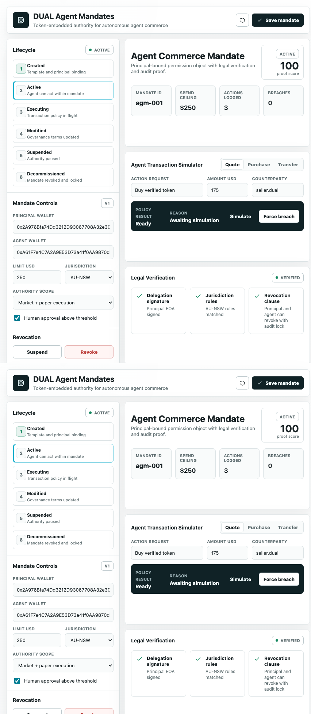
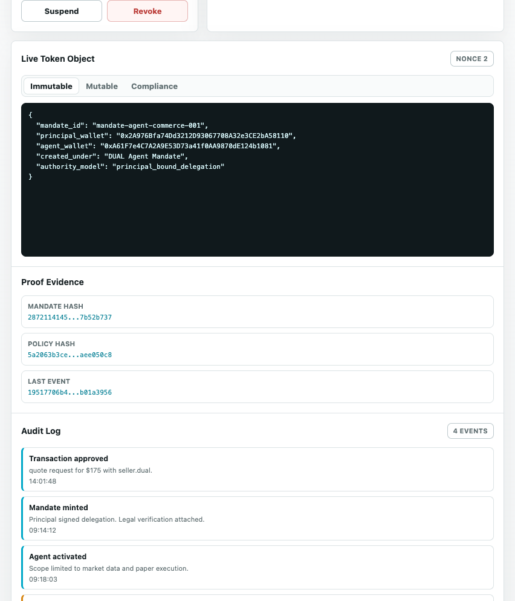

# Agent Mandates Proof Run Sheet

Live app: <https://agent-mandates-dual-demo.vercel.app/>

Purpose: run an Agent Mandates authority check, then show exactly where the evidence lives across the application, DUAL Console, the public API, and the read-only MCP facade.

This run sheet is for the live demo surface. Public evaluation is read-only. Live DUAL writes are operator-gated and should not be performed unless explicitly approved for the run.

## 30-Second Frame

Say this before touching the controls:

> The agent is asking for authority to act. DUAL supplies the binding: mandate template, mandate object, policy hash, mandate hash, state/integrity readback, decision hash, and an operator-gated sync path.

Point to the top status chips:

- `Operator gated`: write-capable routes exist only for approved operators.
- `DUAL readback`: the canonical mandate object is configured.
- `publicWrites=false`: public users and public MCP clients cannot write.
- `Read/write console`: public preview is allowed; sync and mint require an operator token.

## Run The Authority Check

1. Open <https://agent-mandates-dual-demo.vercel.app/>.
2. Confirm the action request shows:
   - Action: `purchase`
   - Label: `Buy verified inventory token`
   - Amount: `$175`
   - Agent wallet: `agent-mandates-demo-agent-wallet-001`
   - Jurisdiction: `AU-NSW`
3. Click `Verify agent action`.
4. Call out the decision:
   - result: `Approved`, `Blocked`, or `Requires approval`;
   - reason;
   - decision hash.
5. Click `Generate proof bundle`.
6. Confirm the proof bundle hash appears in the proof rail.
7. Click `Preview` in the DUAL read/write console to inspect the update payload without writing.

Presenter line:

> This is the moment the demo stops being a policy description. The proposed action receives a fingerprinted authority decision.

## Where To Look In The App

Use the first screen.



1. `Authority corridor`
   - Shows who delegated authority, which agent receives it, scope, jurisdiction, status, and limit.
2. `Mandate state`
   - Shows the current policy state and decision output.
3. `Proof path`
   - Shows hashes and readback identifiers.
4. `DUAL readiness`
   - Shows readback, write mode, operator gate, and public-write status.
5. `Audit log`
   - Shows local demo events and sync intent.

## The Proof Story

Say this:

> The public proof story is readback plus decision proof. It shows the mandate object and template, then fingerprints the proposed action and decision. It does not pretend every public evaluation writes to DUAL.



### DUAL Template

Where to click in the app:

- `Proof rail -> Template`
- Or use DUAL Console template link.

Current production template:

| Field | Value |
| --- | --- |
| Org | `69b935b4187e903f826bbe71` |
| Template name | `io.dual.agent_mandate.demo.v1` |
| Template id | `6a165a580b0bf21f33c111ca` |
| Console link | <https://console-testnet.dual.network/69b935b4187e903f826bbe71/collections/templates?templateId=6a165a580b0bf21f33c111ca> |

What it proves:

- The mandate follows a reusable DUAL schema.
- The public demo is not just a form with arbitrary fields.

### DUAL Mandate Object

Where to click in the app:

- `Proof rail -> Object`
- Or use DUAL Console object link.

Current production object:

| Field | Value |
| --- | --- |
| Object id | `6a165a5a0b0bf21f33c111cc` |
| Console link | <https://console-testnet.dual.network/69b935b4187e903f826bbe71/collections/objects?objectId=6a165a5a0b0bf21f33c111cc> |
| App readback | <https://agent-mandates-dual-demo.vercel.app/api/mandates/current> |

What it proves:

- The authority cockpit can read a canonical DUAL mandate object.
- The evaluator can use DUAL readback as the source of authority state.

### Decision Hash

Where to see it:

- `Mandate state` after clicking `Verify agent action`.
- `Proof path` decision row.
- API or MCP evaluation response.

What it proves:

- The proposed action, result, code, policy hash, mandate hash, and last event hash are fingerprinted into a stable authority decision.
- Agents can store the decision hash in their own audit trail.

### Local Proof Bundle

Where to see it:

- Click `Generate proof bundle`.
- Read the proof bundle hash in the proof rail.

What it proves:

- The reviewer can capture a local proof envelope for the current visible cockpit state.
- This is not a DUAL write. It is a local verifier artifact.

## Public API Verification

Status:

```bash
curl -s https://agent-mandates-dual-demo.vercel.app/api/dual/status
```

Expected production signals:

```text
mode=dual
runtime=vercel
readbackReady=true
operatorGateConfigured=true
writeMode=event_bus
publicWrites=false
```

Current mandate:

```bash
curl -s https://agent-mandates-dual-demo.vercel.app/api/mandates/current
```

Read/write readiness:

```bash
curl -s https://agent-mandates-dual-demo.vercel.app/api/mandates/write-readiness
```

Evaluate:

```bash
curl -s https://agent-mandates-dual-demo.vercel.app/api/mandates/evaluate \
  -H 'content-type: application/json' \
  -d '{"action":{"action_type":"purchase","label":"Buy verified inventory token","amount_usd":175,"counterparty":"verified-seller.dual","agent_wallet":"agent-mandates-demo-agent-wallet-001","jurisdiction":"AU-NSW"}}'
```

Preview the DUAL update payload:

```bash
curl -s https://agent-mandates-dual-demo.vercel.app/api/mandates/preview \
  -H 'content-type: application/json' \
  -d '{"action":"sync","properties":{"mandate_id":"mandate-agent-commerce-001","status":"active"}}'
```

Wrong-token write rejection:

```bash
curl -i https://agent-mandates-dual-demo.vercel.app/api/mandates/sync \
  -H 'content-type: application/json' \
  -H 'x-demo-operator-token: wrong' \
  -d '{"properties":{"mandate_id":"mandate-agent-commerce-001","status":"active"}}'
```

Expected: `403`.

Wrong-token mint rejection:

```bash
curl -i https://agent-mandates-dual-demo.vercel.app/api/mandates/mint \
  -H 'content-type: application/json' \
  -H 'x-demo-operator-token: wrong' \
  -d '{"properties":{"mandate_id":"mandate-agent-commerce-001","status":"active"}}'
```

Expected: `403`.

## MCP Verification

Initialize:

```bash
curl -s https://agent-mandates-dual-demo.vercel.app/mcp \
  -H 'content-type: application/json' \
  -d '{"jsonrpc":"2.0","id":1,"method":"initialize","params":{}}'
```

List tools:

```bash
curl -s https://agent-mandates-dual-demo.vercel.app/mcp \
  -H 'content-type: application/json' \
  -d '{"jsonrpc":"2.0","id":2,"method":"tools/list","params":{}}'
```

Evaluate:

```bash
curl -s https://agent-mandates-dual-demo.vercel.app/mcp \
  -H 'content-type: application/json' \
  -d '{"jsonrpc":"2.0","id":3,"method":"tools/call","params":{"name":"agent_mandates_evaluate_action","arguments":{"action":{"action_type":"purchase","label":"Buy verified inventory token","amount_usd":175,"counterparty":"verified-seller.dual","agent_wallet":"agent-mandates-demo-agent-wallet-001","jurisdiction":"AU-NSW"}}}}'
```

Runnable harness:

```bash
MCP_URL=https://agent-mandates-dual-demo.vercel.app/mcp npm run agent:harness
```

Expected:

- `read_only=true`
- `public_writes=false`
- approved buyer/procurement/paper-trade examples;
- blocked oversized purchase;
- decision hashes present.

## L3/L2/L1 Positioning

Do not claim a public evaluation created a new L3 action, L2 batch, or L1 roll-up. Public evaluation and preview are read-only.

Use this language:

> In v1, the public proof path is DUAL readback plus local decision proof. Public preview shows what would be written. Operator-gated sync can create DUAL event-bus evidence, but public evaluation, preview, and MCP calls do not write.

If an operator-approved sync has been performed for a specific run, add the resulting action/batch identifiers to this run sheet before presenting them.

## If Something Is Pending During A Live Demo

| Situation | What to say |
| --- | --- |
| DUAL readback is unavailable | "This is safe simulation mode; I will not claim live DUAL readback." |
| Decision is `Requires approval` | "The mandate is doing its job: this action needs a human." |
| Object id is missing in an API result | "The evaluator used request/local state rather than canonical DUAL readback." |
| Proof bundle is local only | "Correct. The bundle is a reviewer artifact, not a DUAL write." |
| Someone asks for L1 proof | "This demo proves authority readback and decisions. L1 roll-up evidence belongs to operator-synced DUAL event-bus actions, not public evaluations." |

## Close

End with:

> The product is not the button click. The product is the boundary: who gave the agent authority, what it was allowed to do, why this action passed or failed, and what proof a reviewer can inspect afterward.
